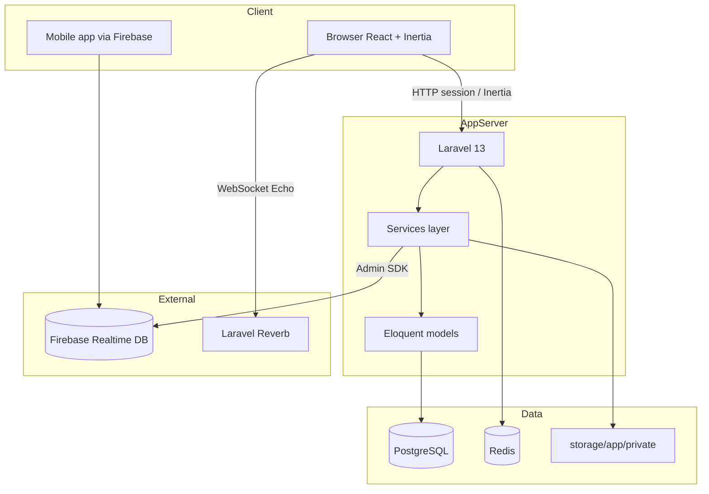
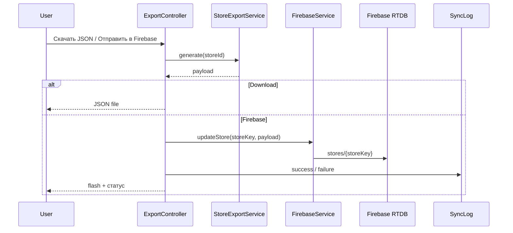

# Архитектура

## Высокоуровневая схема



## Слои приложения

| Слой | Где | Ответственность |
|------|-----|-----------------|
| UI | `resources/js/Pages`, `Components` | Экраны Inertia/React |
| HTTP | `app/Http/Controllers`, `Requests` | Тонкие контроллеры, Form Request валидация |
| Domain logic | `app/Services` | Бизнес-правила, экспорт, биллинг, Firebase |
| Persistence | `app/Models`, `database/migrations` | Eloquent, UUID, soft deletes, scopes |
| AuthZ | Spatie Permission + `app/Support/Permissions` | Роли и permissions |
| Audit | Spatie Activity Log | Журнал изменений |

Правило проекта: **контроллеры тонкие — логика в сервисах**.

## Мультиарендность (tenancy)

Каждый «клиент платформы» — запись `Tenant`. Пользователи и основные сущности привязаны через `tenant_id`.

- Global scope `BelongsToTenant` ограничивает выборки текущим tenant пользователя.
- Super Admin обходит tenant-фильтр.
- Оборудование, привязанное к магазину, фильтруется через `BelongsToStoreTenant` (по `store.tenant_id`).
- Заведующий дополнительно ограничен отделом (`RestrictsToOwnDepartment`).
- Middleware `tenant.active` и `subscription.active` закрывают доступ при неактивном tenant / истекшей подписке.

## Идентификаторы и данные

- Первичные ключи — **UUID**.
- Таблицы: `timestamps` + **soft deletes**.
- Мультиязычные поля — JSONB вида `{"ru":"...","en":"..."}`.
- Даты хранятся в **UTC**, отображение — в timezone пользователя.

## Frontend

- SPA-подобное поведение через **Inertia.js**: сервер отдаёт props, клиент рендерит React-страницы без отдельного REST для UI.
- Сборка: Vite (`npm run build` → `public/build`, в git обычно не коммитится).
- Realtime (чат/уведомления): Laravel Echo + Reverb.

## Backend API

Версионированный JSON API: `/api/v1/...` (Sanctum). Используется мобильными/внешними клиентами наряду с session-UI. Подробнее: [API.md](API.md).

## Кэширование

В правилах проекта: Redis, ключи вида `store_{uuid}:layout` для layout магазина. Драйвер задаётся `CACHE_STORE` / Redis в `.env`.

## Безопасность (кратко)

- Session cookies: `SESSION_ENCRYPT`, `HTTP_ONLY`, `SAME_SITE`, в проде `SESSION_SECURE_COOKIE=true` на HTTPS.
- Security headers middleware.
- Секреты только в `.env` и `storage/app/private`.
- Права проверяются через permission middleware / политики сервисов.

## Поток экспорта магазина



## Ключевые каталоги

```
app/Http/Controllers/   # веб + Api/V1
app/Services/           # бизнес-логика
app/Models/             # доменные сущности
app/Support/            # Permissions и константы
resources/js/Pages/     # экраны по модулям
routes/web.php          # UI
routes/api.php          # /api/v1
```
