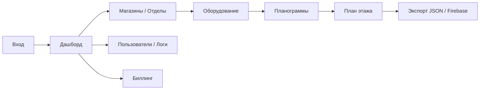

# Обзор продукта

## Что это

**Smart Planogram Control Center** — control center (панель управления) для розничных планограмм. Это не «сайт-витрина», а рабочая система для сотрудников сети и магазинов: планирование выкладки, учёт оборудования и синхронизация с мобильным приложением.

## Зачем

В ритейле планограмма отвечает на вопросы: *какой товар*, *на какой полке*, *в каком магазине*, *в каком порядке и с какими фейсингами*. Без единой системы данные разъезжаются между Excel, локальными файлами и телефоном мерчандайзера.

Платформа даёт:

1. **Единый источник правды** по магазинам, отделам, SKU и оборудованию.
2. **Визуальную и структурированную планограмму** (полки / холодильники / стенды + план зала).
3. **Контроль доступа** по ролям и арендаторам (tenant).
4. **Выгрузку в Firebase**, чтобы мобильный клиент получал актуальные данные магазина.
5. **Коммерческий контур** — тарифы, подписки, счета, юридические документы.

## Для кого

| Роль в системе | Типичная задача |
|----------------|-----------------|
| Super Admin | Управление всеми арендаторами, тарифами, БД, юридическими текстами |
| Заместитель | Операционное управление сетью в рамках своего tenant |
| Заведующий | Работа по своему отделу/магазину: оборудование, товары, планограммы |
| Программист | Просмотр данных, интеграции, экспорт в Firebase |
| Мерчандайзер | Просмотр планограмм и товаров |

Подробнее: [ROLES.md](ROLES.md).

## Как выглядит работа пользователя (упрощённо)

1. Арендатор (tenant) активен и имеет действующую подписку.
2. Пользователь настраивает магазины и отделы.
3. Создаёт оборудование (полки, холодильники, стенды) с уровнями.
4. Размещает товары на уровнях (placements).
5. При необходимости правит план зала.
6. Генерирует JSON и/или отправляет магазин в Firebase.

## Что система не делает

- Не заменяет кассовую / ERP систему (нет полноценного складского учёта продаж).
- Не хостит мобильное приложение — только backend + панель + синхронизация в Firebase RTDB.
- Не хранит секреты Firebase в git — только на сервере / в настройках UI.

## Связанные документы

- Архитектура: [ARCHITECTURE.md](ARCHITECTURE.md)
- Модули: [MODULES.md](MODULES.md)
- Firebase: [FIREBASE.md](FIREBASE.md)
